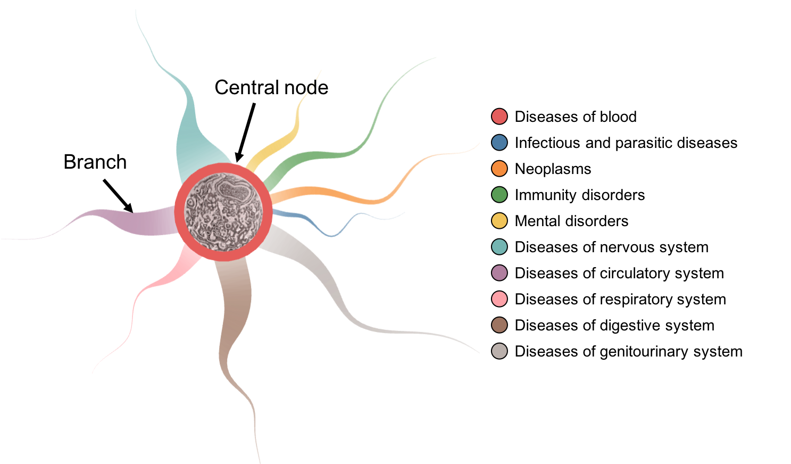

## A Code for Generating Organic Visual Metaphors for Conditional Co-occurrence

About
-----

* This project is derived from the paper below.     
***An Organic Visual Metaphor for Public Understanding of Conditional Co-occurrences***    
Keshav Dasu, Takanori Fujiwara, and Kwan-Liu Ma    
In Proceedings of IEEE Scientific Visualization (SciVis), 2018.

* Features
  * Polygon generation for visualizing an organic visual metaphor based on the algorithm in the paper above

  * Helper for choosing the parameter &beta; to avoid overlaps in the visualized result

  * Web renderer example with three.js

******

Requirements
-----
* Note: Tested on macOS Sequoia
* python3 (latest)
* numpy and scipy (latest)
* A web-browser supporting WebGL (e.g., Chrome) if looking at the rendering example

******

Usage
-----
##### polygon_gen.py (polygon generation)

* Run a code below in the terminal (replace input/out_json_file, e.g., sample_data/sample_input.json). This generates a json file that includes mesh information. 

  `python3 polygon_gen.py -i input_json_file -o output_json_file`

* You can use more parameters, including &alpha;, &beta; used in the paper. See help with

  `python3 polygon_gen.py -h`

* You can find input and output json file examples in "sample_data" directory.

  * a format for an input json file
     - name: a name for the group
     - type: select from "branch" or "central node"
     - values: values of co-occurence metric from the central node to the corresponding branch

##### beta_overlap_thres.py (helper for selecting a good parameter &beta;)
* Run a code below in the terminal. This outputs the thresholds of &beta; values for all branches for avoiding overlaps between branches. If you set smaller &beta; for running polygon_gen.py, you can generate polygons which avoid overlaps.

  `python3 beta_overlap_thres.py -i input_json_file`

* You can use more parameters, including &alpha; used in the paper. See help with

    `python3 beta_overlap_thres.py -h`

##### rendering_example/index.html (rendering example with WebGL)
* Lauch index.html with some web-server. One easy way is using http.server from python3.

  `python3 -m http.server`

  Then, type ''http://localhost:8000/'' in your web-browser. After that, select index.html.

******

## How to Cite
Please, cite:    
Keshav Dasu, Takanori Fujiwara, and Kwan-Liu Ma, "An Organic Visual Metaphor for Public Understanding of Conditional Co-occurrences". In Proceedings of IEEE Scientific Visualization (SciVis), 2018.

******

## Contributor
Takanori Fujiwara, Keshav Dasu, Sandra Bae, Kwan-Liu Ma
